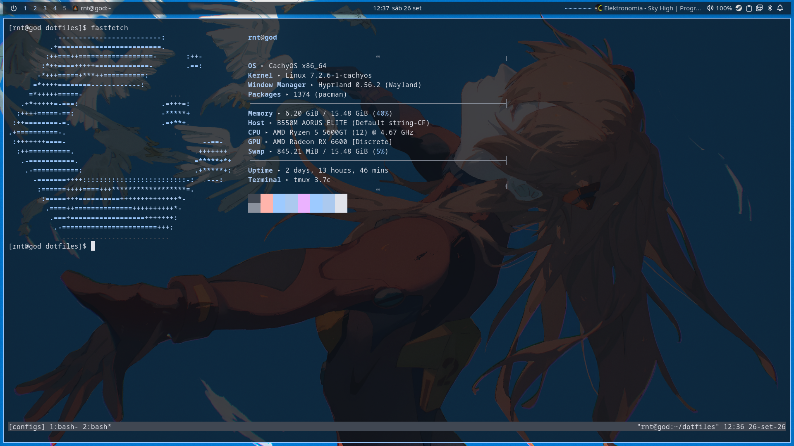
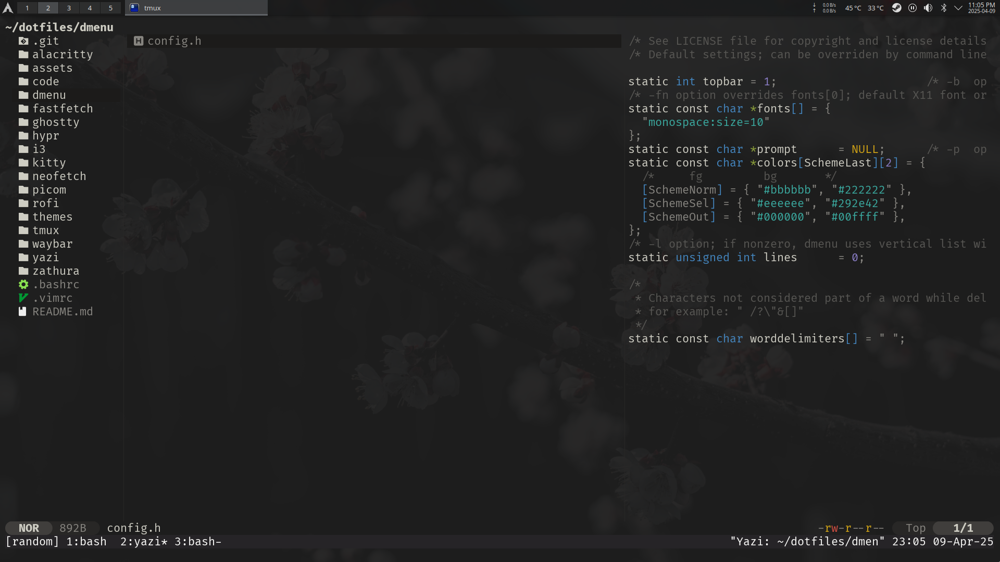
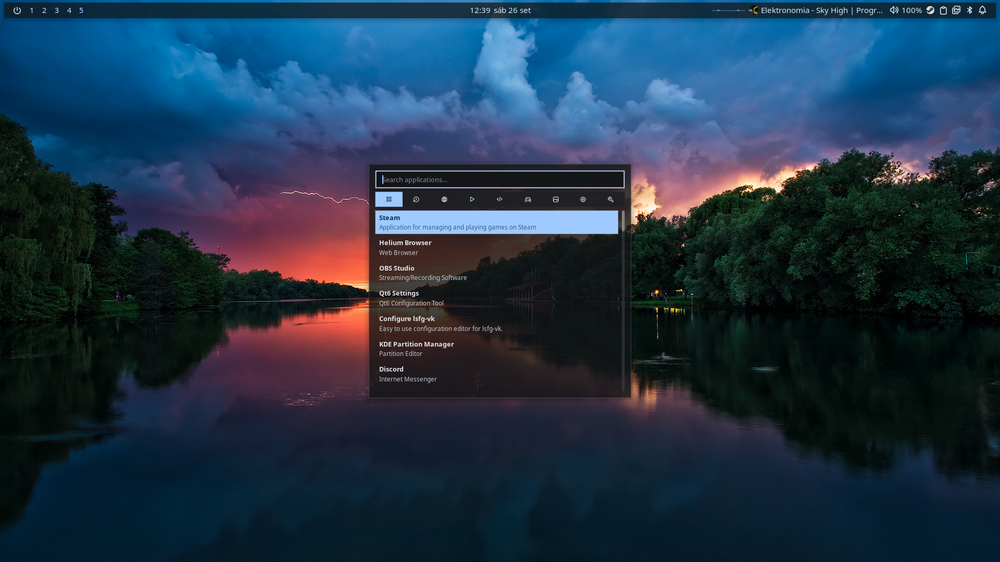
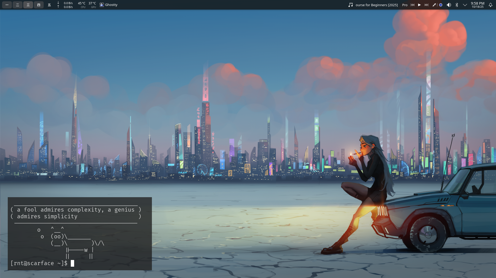
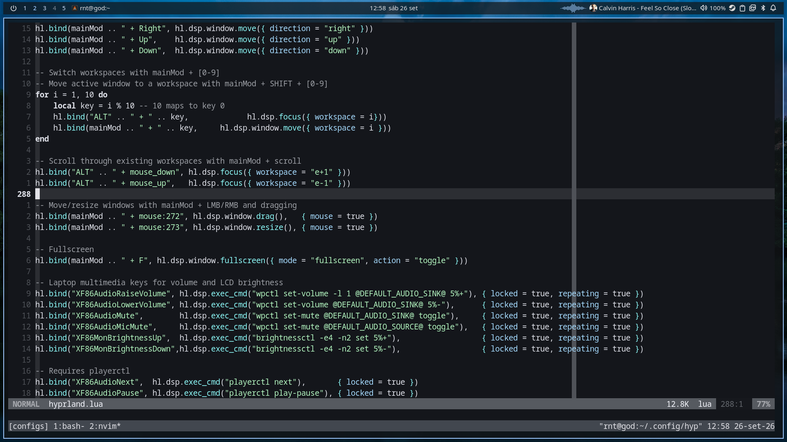
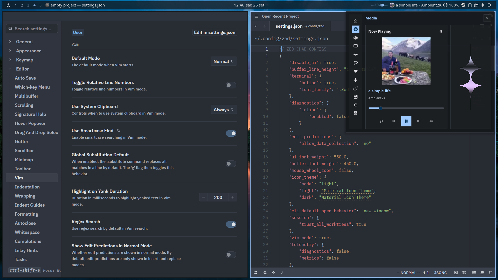
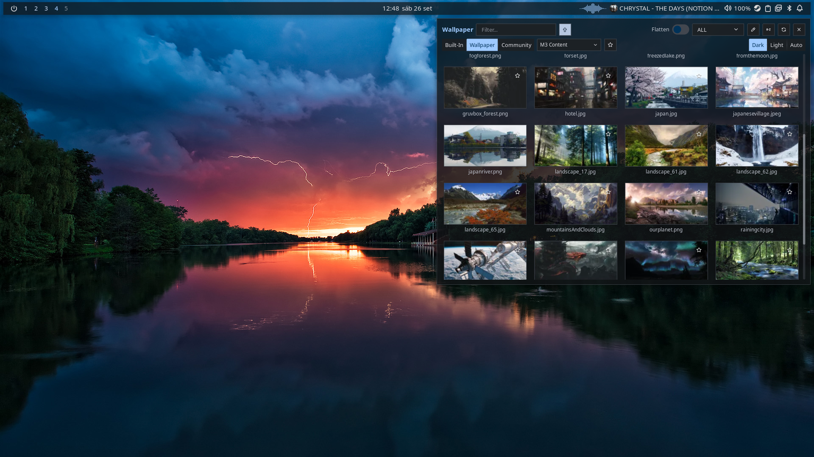

# Arch linux customization:
Today i am using hyprland with noctalia shell.
I like separating my programs in different workspace based on
their function. It is less mental overhead for me.

Minimal and fast configuration:
 

System info

  

Yazi  "i tend to avoid file managers but i like the looks of yazi."

  

Desktop

  

  

Code editors

  

  

Wallpapers

  

You can check out my other repository for wallpapers.
